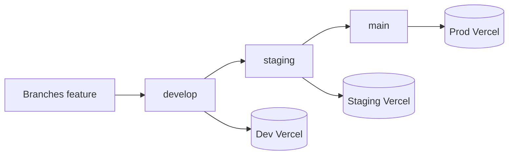

# Déploiement Vercel

> Dernière mise à jour : 2025-06-18

## Environnements

Trois projets Vercel distincts, chacun connecté au même dépôt GitHub :

| Environnement | Branche Git | Projet Vercel | URL |
|---------------|-------------|---------------|-----|
| **Production** | `main` | `la-ferme-se-rebelle` | https://la-ferme-se-rebelle.vercel.app |
| **Staging** | `staging` | `la-ferme-se-rebelle-staging` | https://la-ferme-se-rebelle-staging.vercel.app |
| **Dev** | `develop` | `la-ferme-se-rebelle-dev` | https://la-ferme-se-rebelle-dev.vercel.app |

### Flux Git



1. Développement et intégration sur `develop`
2. Validation pré-production sur `staging`
3. Mise en production via `main`

### Configuration par projet Vercel

Pour **chaque** projet :

| Paramètre | Valeur |
|-----------|--------|
| **Settings → Git → Production Branch** | `main`, `staging` ou `develop` selon le projet |
| **Settings → General → Framework Preset** | `Next.js` |
| **Settings → Domains** | Domaine de l'environnement (voir tableau) |
| **`AUTH_URL`** | URL publique de l'environnement |

Variables d'environnement obligatoires (Production + Preview) :

| Variable | Description |
|----------|-------------|
| `DATABASE_URL` | URL Neon **poolée** (`-pooler`) |
| `DIRECT_URL` | URL Neon **directe** (migrations) |
| `AUTH_SECRET` | Chaîne aléatoire base64 (32+ octets) |
| `AUTH_URL` | URL de l'environnement (ex. `https://la-ferme-se-rebelle-dev.vercel.app`) |

> Utiliser une base Neon **distincte** par environnement est recommandé (dev / staging / prod).

### Script de build

Le build exécute `scripts/vercel-build.mjs` :

1. `prisma generate`
2. `prisma migrate deploy` (si `DIRECT_URL` présent)
3. `next build`

Pour le **premier déploiement** d'un environnement, ajouter temporairement `RUN_DB_SEED=true`, puis la retirer.

---

## Vérifier un déploiement

Remplacer `BASE` par l'URL de l'environnement :

```bash
curl https://BASE/health.json
curl https://BASE/api/health
curl https://BASE/connexion
```

| Résultat | Signification |
|----------|---------------|
| `/health.json` → JSON | App déployée ✓ |
| `/api/health` → `{"app":"ok","database":"ok"}` | App + BDD OK ✓ |
| `/api/health` → 503 `database:error` | App OK, BDD à configurer |
| 404 `DEPLOYMENT_NOT_FOUND` | Aucun déploiement sur ce domaine |
| 401 partout | Protection Vercel active |

---

## Dépannage 404 — Production

### Diagnostic rapide

| URL testée | Code | Signification |
|------------|------|---------------|
| `https://la-ferme-se-rebelle.vercel.app/health.json` | **404** | Le domaine principal n'a **aucun déploiement** assigné |
| `https://la-ferme-se-rebelle.vercel.app/api/health` | **404** | Idem — ce n'est pas un bug de l'API |
| URL de déploiement (`…-patatepower1-8666s-projects.vercel.app`) | **401** | L'app est déployée mais **protégée par mot de passe Vercel** |

**Conclusion :** le build fonctionne. Le problème est la configuration Vercel (domaine + protection).

### Étape 1 — Désactiver la protection des déploiements

1. Ouvrez [vercel.com/dashboard](https://vercel.com/dashboard)
2. Projet **la-ferme-se-rebelle**
3. **Settings** → **Deployment Protection**
4. Section **Vercel Authentication** (ou Standard Protection)
5. Pour **Production** : passez sur **Disabled** (Désactivé)
6. Enregistrez

Sans cela, même un déploiement correct renvoie 401.

### Étape 2 — Assigner un déploiement à la production

1. Onglet **Deployments**
2. Trouvez le dernier déploiement de la branche `main` (statut **Ready**, icône verte)
3. Cliquez sur **⋯** (trois points) à droite
4. Choisissez **Promote to Production** (Promouvoir en production)

Attendez 1 à 2 minutes.

### Étape 3 — Vérifier le framework et la branche

**Settings** → **General** :
- **Framework Preset** = `Next.js`
- **Root Directory** = vide (ou `.`)
- **Node.js Version** = 20.x ou 22.x

**Settings** → **Git** :
- **Production Branch** = `main`

### Étape 4 — Vérifier le domaine

**Settings** → **Domains** :
- `la-ferme-se-rebelle.vercel.app` doit apparaître
- Statut : **Valid** avec une coche verte

Si le domaine est sur un **autre projet** Vercel :
- Supprimez-le de l'ancien projet, ou
- Ajoutez-le au bon projet (celui connecté au repo GitHub)

### Étape 5 — Variables d'environnement

**Settings** → **Environment Variables** (cocher Production + Preview) :

| Variable | Exemple |
|----------|---------|
| `DATABASE_URL` | URL Neon **poolée** (`-pooler`) |
| `DIRECT_URL` | URL Neon **directe** |
| `AUTH_SECRET` | Chaîne aléatoire base64 |
| `AUTH_URL` | `https://la-ferme-se-rebelle.vercel.app` |

Puis **Deployments** → **⋯** → **Redeploy** (sans cache).

### Étape 6 — Tests après correction

```
1. https://la-ferme-se-rebelle.vercel.app/health.json
   → doit afficher du JSON (fichier statique)

2. https://la-ferme-se-rebelle.vercel.app/api/health
   → {"app":"ok","database":"ok"} ou database:"error" (503)

3. https://la-ferme-se-rebelle.vercel.app/connexion
   → page de connexion
```

| Résultat | Action |
|----------|--------|
| `/health.json` OK, `/api/health` 503 `database:error` | BDD : vérifier `DATABASE_URL` + lancer migrations |
| Tout 404 encore | Domaine pas sur le bon projet → étape 4 |
| 401 partout | Protection encore active → étape 1 |

---

## Seed initial (comptes démo)

Une fois l'app accessible sur un environnement, ajoutez temporairement :

```
RUN_DB_SEED=true
```

Redéployez, testez la connexion avec `patron@ferme.local` / `patron1234`, puis **supprimez** `RUN_DB_SEED`.

---

## Où trouver la bonne URL de déploiement

**Deployments** → cliquez sur un déploiement **Ready** → **Visit**

L'URL ressemble à :
`https://la-ferme-se-rebelle-xxxxx-patatepower1-8666s-projects.vercel.app`

C'est l'URL de preview. Après promotion, le domaine de l'environnement (`la-ferme-se-rebelle.vercel.app`, `-staging` ou `-dev`) doit fonctionner pareil.
