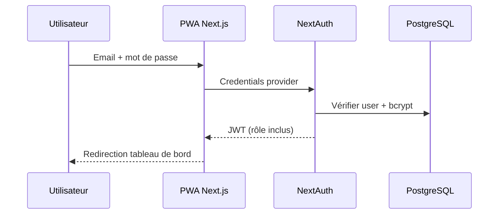
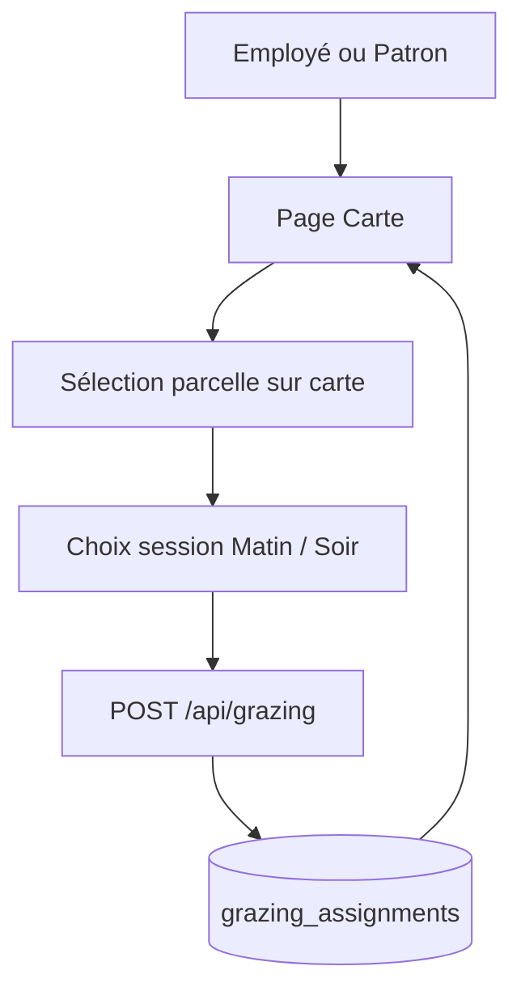
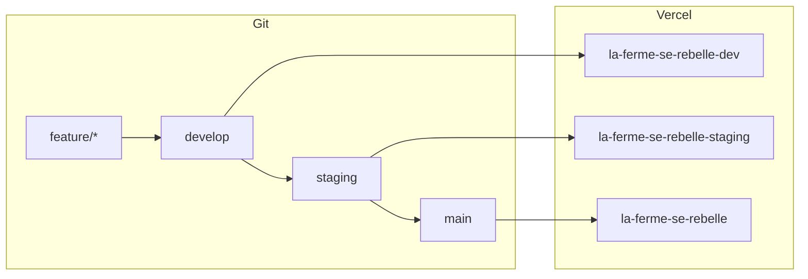

# Architecture — La Ferme se Rebelle

> Dernière mise à jour : 2025-06-19

## Vue d'ensemble

Application PWA de gestion d'une ferme laitière. Première version centrée sur les vaches laitières, extensible à d'autres élevages.

## Stack technique

| Couche | Technologie |
|--------|-------------|
| Frontend | Next.js 16, React 19, Tailwind CSS 4 |
| PWA | `@ducanh2912/next-pwa`, manifest, icônes |
| Cartographie | Leaflet, react-leaflet, tuiles OpenStreetMap |
| API | Next.js Route Handlers (`/api/*`) |
| Auth | NextAuth.js v5, JWT, rôles OWNER / MANAGER / EMPLOYEE |
| ORM | Prisma 7 |
| Base de données | PostgreSQL (Neon) |
| Hébergement | Vercel |
| Tests | Vitest (unitaires), Playwright (e2e) |

## Structure des dossiers

```
src/
├── app/
│   ├── f/[farmSlug]/       # Pages scopées par ferme (slug URL)
│   │   ├── tableau-de-bord/
│   │   ├── carte/
│   │   └── admin/
│   ├── fermes/             # Sélecteur si multi-fermes
│   ├── api/f/[farmSlug]/   # API REST par ferme
│   └── connexion/
├── components/
├── lib/
│   ├── farm-auth.ts        # Vérification d'accès ferme
│   ├── permissions.ts      # Matrice de droits (source de vérité code)
│   └── farm-path.ts        # Helpers de chemins /f/{slug}
prisma/
docs/
e2e/
```

## Flux principaux

### Routage multi-fermes

```mermaid
flowchart TD
  L[Connexion] --> F{Plusieurs fermes ?}
  F -->|Oui| S[/fermes — sélecteur]
  F -->|Non| D["/f/{slug}/tableau-de-bord"]
  S --> D
  D --> C["/f/{slug}/carte"]
  D --> A["/f/{slug}/admin/*"]
```

Un utilisateur peut appartenir à plusieurs fermes avec un rôle distinct par ferme (`farm_memberships`).

### Authentification



### Sortie après traite



## Déploiement

### Environnements Vercel

Trois projets Vercel, un par environnement, connectés au même dépôt :

| Environnement | Branche | URL |
|---------------|---------|-----|
| Production | `main` | https://la-ferme-se-rebelle.vercel.app |
| Staging | `staging` | https://la-ferme-se-rebelle-staging.vercel.app |
| Dev | `develop` | https://la-ferme-se-rebelle-dev.vercel.app |



Voir [DEPLOYMENT.md](../DEPLOYMENT.md) pour la configuration détaillée et le dépannage.

### Variables d'environnement (Vercel)

- `DATABASE_URL` — URL poolée Neon (`-pooler`) pour l'application
- `DIRECT_URL` — URL directe pour migrations Prisma CLI
- `AUTH_SECRET` — secret JWT (32+ octets aléatoires)
- `AUTH_URL` — URL publique de l'environnement (distincte par projet Vercel)

### Pipeline build

Script `scripts/vercel-build.mjs` :

1. `prisma generate`
2. `prisma migrate deploy`
3. `next build`

## Sécurité

- Mots de passe hashés (bcrypt, 12 rounds)
- Middleware protège toutes les routes sauf `/connexion`
- Routes `/f/{slug}/admin/*` réservées aux rôles `OWNER` et `MANAGER` **dans la ferme**
- API `/api/f/{slug}/*` : vérification d'adhésion en base (`farm_memberships`)
- Validation Zod sur toutes les entrées API
- Matrice de droits documentée : [`docs/permissions/MATRICE_DROITS.md`](../permissions/MATRICE_DROITS.md)
- Implémentation centralisée : `src/lib/permissions.ts`

## Évolutions prévues

- Éditeur de polygones sur carte (création parcelles)
- Invitation d'utilisateurs existants sans mot de passe
- Mode hors-ligne avancé (sync IndexedDB)
- Notifications push pour rappels de traite
