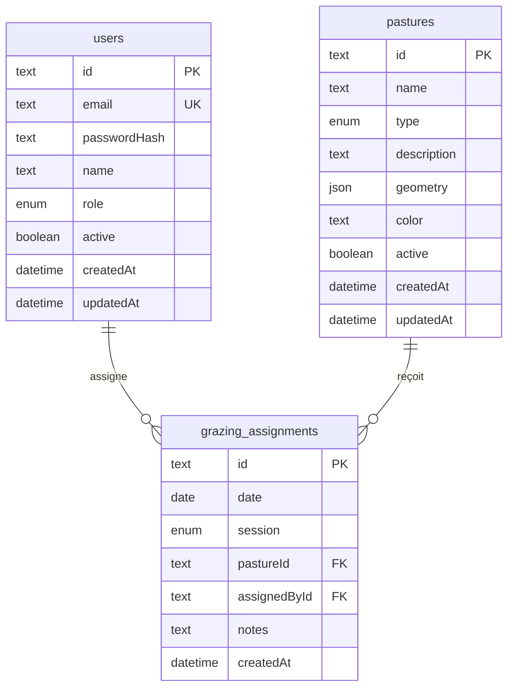

# Base de données — La Ferme se Rebelle

> Dernière mise à jour : 2025-06-18

## Diagramme entité-relation



## Enums

| Enum | Valeurs | Description |
|------|---------|-------------|
| `Role` | `OWNER`, `EMPLOYEE` | Patron ou employé |
| `ParcelType` | `PASTURE`, `FIELD` | Pâture ou champ |
| `MilkingSession` | `MORNING`, `EVENING` | Traite matin ou soir |

## Tables

### `users`

| Colonne | Type | Contraintes | Description |
|---------|------|-------------|-------------|
| id | TEXT | PK, cuid | Identifiant |
| email | TEXT | UNIQUE, NOT NULL | Connexion |
| passwordHash | TEXT | NOT NULL | bcrypt |
| name | TEXT | NOT NULL | Nom affiché |
| role | Role | DEFAULT EMPLOYEE | Patron ou employé |
| active | BOOLEAN | DEFAULT true | Compte actif |
| createdAt | TIMESTAMP | auto | Création |
| updatedAt | TIMESTAMP | auto | Mise à jour |

### `pastures`

| Colonne | Type | Contraintes | Description |
|---------|------|-------------|-------------|
| id | TEXT | PK | Identifiant |
| name | TEXT | NOT NULL | Nom parcelle |
| type | ParcelType | DEFAULT PASTURE | Pâture ou champ |
| description | TEXT | nullable | Notes |
| geometry | JSONB | NOT NULL | Polygone GeoJSON |
| color | TEXT | DEFAULT #22c55e | Couleur carte |
| active | BOOLEAN | DEFAULT true | Parcelle visible |
| createdAt / updatedAt | TIMESTAMP | auto | Audit |

### `grazing_assignments`

| Colonne | Type | Contraintes | Description |
|---------|------|-------------|-------------|
| id | TEXT | PK | Identifiant |
| date | DATE | NOT NULL | Jour concerné |
| session | MilkingSession | NOT NULL | Matin ou soir |
| pastureId | TEXT | FK → pastures | Parcelle cible |
| assignedById | TEXT | FK → users | Auteur |
| notes | TEXT | nullable | Commentaire |
| createdAt | TIMESTAMP | auto | Horodatage |

**Contrainte unique** : `(date, session)` — une seule sortie par traite et par jour.

## Index

| Index | Colonnes | Justification |
|-------|----------|---------------|
| `users_email_key` | email | Unicité connexion |
| `grazing_assignments_date_session_key` | date, session | Règle métier |
| `grazing_assignments_pastureId_idx` | pastureId | Jointures carte |

## Seed (données de démo)

| Email | Mot de passe | Rôle |
|-------|--------------|------|
| patron@ferme.local | patron1234 | OWNER |
| employe@ferme.local | employe1234 | EMPLOYEE |

3 parcelles : Pâture Nord, Pâture Sud, Champ Est (polygones autour de 47°N, 2°E).

## Migrations

| Migration | Description |
|-----------|-------------|
| `20250618000000_init` | Schéma initial users, pastures, grazing_assignments |

## Commandes

```bash
# Variables : DATABASE_URL (pooler) + DIRECT_URL (direct)
npx prisma migrate deploy   # appliquer en prod
npx prisma db seed          # données de démo
npx prisma studio           # explorer la BDD
```
