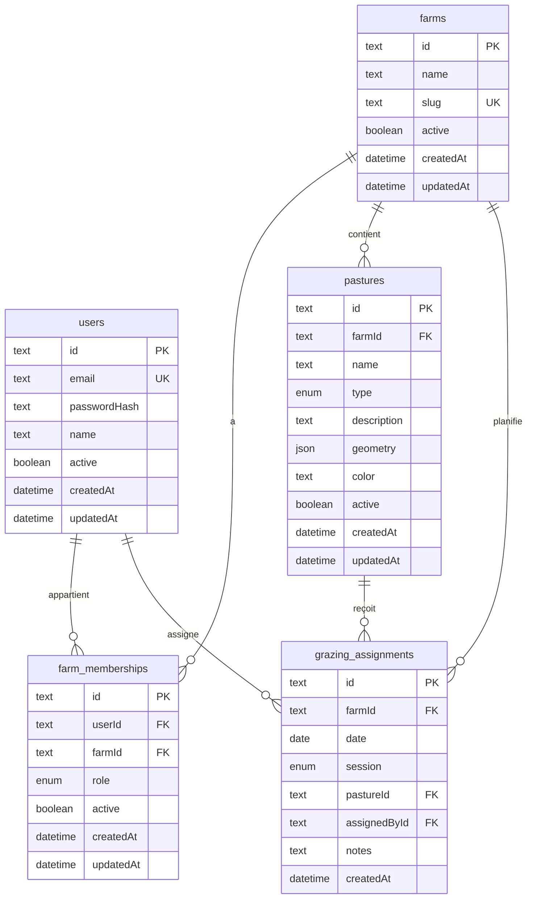

# Base de données — La Ferme se Rebelle

> Dernière mise à jour : 2025-06-18

## Diagramme entité-relation



## Enums

| Enum | Valeurs | Description |
|------|---------|-------------|
| `Role` | `OWNER`, `EMPLOYEE` | Rôle **par ferme** (via `farm_memberships`) |
| `ParcelType` | `PASTURE`, `FIELD` | Pâture ou champ |
| `MilkingSession` | `MORNING`, `EVENING` | Traite matin ou soir |

## Tables

### `farms`

| Colonne | Type | Contraintes | Description |
|---------|------|-------------|-------------|
| id | TEXT | PK, cuid | Identifiant |
| name | TEXT | NOT NULL | Nom affiché |
| slug | TEXT | UNIQUE, NOT NULL | Identifiant URL (`/f/{slug}/...`) |
| active | BOOLEAN | DEFAULT true | Ferme active |
| createdAt / updatedAt | TIMESTAMP | auto | Audit |

### `users`

Compte global (email unique). Le rôle est porté par `farm_memberships`.

| Colonne | Type | Contraintes | Description |
|---------|------|-------------|-------------|
| id | TEXT | PK, cuid | Identifiant |
| email | TEXT | UNIQUE, NOT NULL | Connexion |
| passwordHash | TEXT | NOT NULL | bcrypt |
| name | TEXT | NOT NULL | Nom affiché |
| active | BOOLEAN | DEFAULT true | Compte actif |
| createdAt / updatedAt | TIMESTAMP | auto | Audit |

### `farm_memberships`

| Colonne | Type | Contraintes | Description |
|---------|------|-------------|-------------|
| id | TEXT | PK | Identifiant |
| userId | TEXT | FK → users | Utilisateur |
| farmId | TEXT | FK → farms | Ferme |
| role | Role | DEFAULT EMPLOYEE | Patron ou employé **dans cette ferme** |
| active | BOOLEAN | DEFAULT true | Accès à la ferme |
| createdAt / updatedAt | TIMESTAMP | auto | Audit |

**Contrainte unique** : `(userId, farmId)` — un utilisateur ne peut avoir qu'une adhésion par ferme.

### `pastures`

| Colonne | Type | Contraintes | Description |
|---------|------|-------------|-------------|
| id | TEXT | PK | Identifiant |
| farmId | TEXT | FK → farms | Ferme propriétaire |
| name | TEXT | NOT NULL | Nom parcelle |
| type | ParcelType | DEFAULT PASTURE | Pâture ou champ |
| description | TEXT | nullable | Notes |
| geometry | JSONB | NOT NULL | Polygone GeoJSON |
| color | TEXT | DEFAULT #22c55e | Couleur carte |
| active | BOOLEAN | DEFAULT true | Parcelle visible |
| createdAt / updatedAt | TIMESTAMP | auto | Audit |

### `grazing_assignments`

| Colonne | Type | Contraintes | Description |
|---------|------|-------------|-------------|
| id | TEXT | PK | Identifiant |
| farmId | TEXT | FK → farms | Ferme |
| date | DATE | NOT NULL | Jour concerné |
| session | MilkingSession | NOT NULL | Matin ou soir |
| pastureId | TEXT | FK → pastures | Parcelle cible |
| assignedById | TEXT | FK → users | Auteur |
| notes | TEXT | nullable | Commentaire |
| createdAt | TIMESTAMP | auto | Horodatage |

**Contrainte unique** : `(farmId, date, session)` — une seule sortie par traite et par jour **par ferme**.

## Index

| Index | Colonnes | Justification |
|-------|----------|---------------|
| `farms_slug_key` | slug | Routage URL |
| `users_email_key` | email | Unicité connexion |
| `farm_memberships_userId_farmId_key` | userId, farmId | Une adhésion par couple |
| `grazing_assignments_farmId_date_session_key` | farmId, date, session | Règle métier |
| `pastures_farmId_idx` | farmId | Filtrage par ferme |

## Seed (données de démo)

| Ferme | Slug |
|-------|------|
| La Ferme se Rebelle | `ferme-rebelle` |
| Ferme des Collines | `ferme-des-collines` |

| Email | Mot de passe | Fermes |
|-------|--------------|--------|
| patron@ferme.local | patron1234 | Les deux (OWNER) |
| employe@ferme.local | employe1234 | Les deux (EMPLOYEE) |

## Migrations

| Migration | Description |
|-----------|-------------|
| `20250618000000_init` | Schéma initial |
| `20250618120000_multi_farm` | Fermes, adhésions, scope par ferme |

## Commandes

```bash
# Variables : DATABASE_URL (pooler) + DIRECT_URL (direct)
npx prisma migrate deploy   # appliquer en prod
npx prisma db seed          # données de démo
npx prisma studio           # explorer la BDD
```
